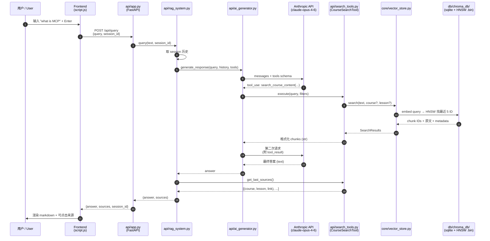
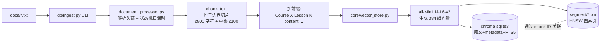
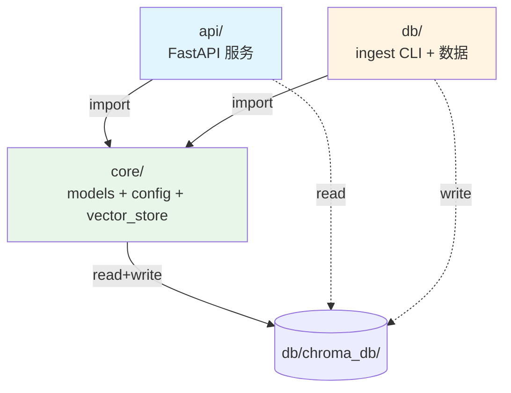

# 代码库导览 / Codebase Tour

这是这个 RAG 课程问答项目的入门文档，按五步带你从高层概览走到能跑起来。

A five-step walkthrough of this RAG course-QA project, from high-level overview to running it locally.

---

## 第一步：高层概览 / Step 1: High-level Overview

> **中文：** 给我一个这个代码库的概览。
> **English:** Give me an overview of this codebase.

这是一个**课程资料 RAG 聊天机器人**：用户在网页上提问，系统从课程文档里检索相关片段，再让 Claude 基于检索结果生成回答。

It's a **course-materials RAG (Retrieval-Augmented Generation) chatbot**: users ask questions in a web UI, the system retrieves relevant snippets from course transcripts, and Claude generates an answer grounded in those snippets.

### 顶层结构 / Top-level layout

```
project-root/
├── core/         共享代码：models, config, ChromaDB 封装
├── db/           离线数据层：文档解析 + ingest CLI + chroma_db/ 存储
├── api/          在线 FastAPI 服务：HTTP 接口 + Claude tool-use 编排
├── frontend/     静态 HTML/CSS/JS 前端
├── docs/         课程 .txt 源文件
├── evals/        检索评估工具（Recall@k、MRR）
└── run.sh        一键启动：先 ingest 再启动 API
```

| 模块 | 职责 | 是否被另一模块引用 |
|---|---|---|
| `core/` | 模型、配置、ChromaDB 封装（读写都通过这个） | 被 `api/` 和 `db/` 共同依赖 |
| `db/` | 文档解析、ingest CLI、ChromaDB 数据目录 | **不**被 `api/` 引用 |
| `api/` | FastAPI 服务、Claude tool-use 调度、会话管理 | 启动时**不读** `docs/` |

### 关键设计：tool-use RAG (agentic) vs 传统直接注入式 RAG

本项目是 **tool-use RAG（agentic RAG）**，传统是 **直接注入式 RAG**。本质区别：

| | 传统 RAG | 本项目 |
|---|---|---|
| **检索触发** | 每次请求都强制检索 | Claude 自主决定是否检索、检索什么 |
| **流程** | retrieve → stuff into prompt → generate（固定一次） | LLM 循环：思考 → 调工具 → 看结果 → 再调工具/出答案（最多 `MAX_TOOL_ROUNDS=2` 轮） |
| **query** | 用户原问题直接做 embedding | Claude 改写/拆解后作为 tool 参数传入 |
| **工具选择** | 只有一个检索器 | 多工具（`search_course_content` vs `get_course_outline`），模型自己挑 |
| **多步推理** | 做不到（除非外层手写 pipeline） | 原生支持：先查大纲 → 再查具体 lesson |
| **失败恢复** | 第一次检索错了就完蛋 | 看到烂结果可以改写 query 再搜一次 |
| **闲聊/无关问题** | 照样检索，浪费且污染 context | 模型可以不调工具直接回答 |

核心差异一句话：**传统 RAG 把检索当成 prompt 预处理；本项目把检索当成 LLM 可调用的动作**，所以 Claude 能像 agent 一样规划「要不要查、查什么、查完够不够、要不要再查」。代价是多一次 API 往返和更复杂的循环控制（见 `api/ai_generator.py` 的多轮 loop + 兜底调用）。

### 技术栈 / Tech stack

- **Python 3.13**, FastAPI, ChromaDB（嵌入式模式，无独立服务）
- **Anthropic Claude**（`claude-opus-4-6`）+ tool use
- **sentence-transformers** `all-MiniLM-L6-v2`（本地 384 维 embedding）
- **uv** 做包管理；前端是无构建步骤的静态文件

---

## 第二步：流程追踪 / Step 2: Process Tracing

> **中文：** 这些文档是怎么被处理的？
> **English:** How are these documents processed?

文档处理是**离线的一次性任务**，由 `db/ingest.py` 触发，跟 API 进程完全解耦。

Document processing is an **offline, one-shot task** triggered by `db/ingest.py`, fully decoupled from the API process.

### 触发方式

```bash
uv run python -m db.ingest --docs docs           # 跳过库中已有课程
uv run python -m db.ingest --docs docs --clear   # 清空后重建
```

幂等：用默认参数重复运行是安全的（按课程标题去重）。

### 处理管道

每个 `docs/*.txt` 文件经过这五步：

1. **解析头部元信息**（`db/document_processor.py: _parse_course_header`）
   读前 4 行，正则匹配 `Course Title:` / `Course Link:` / `Course Instructor:`，构造 `Course` 对象。

2. **状态机扫描课时**（`process_course_document` 主循环）
   逐行扫描，正则匹配 `^Lesson\s+(\d+):\s*(.+)$` 作为节边界。遇到新节就把上一节的累积正文 flush 出来；可选的 `Lesson Link:` 行会被预读并消费掉（避免污染正文）。

3. **按句子切片**（`chunk_text`）
   - **句子边界**：用正则切句（处理了缩写如 "Dr."、"e.g."）
   - **累加到 ≤800 字符**：从句子 i 开始累加，加下一句会超 `CHUNK_SIZE` 就停。**永远不会切断句子中间**。
   - **整句重叠 ≤100 字符**：从当前 chunk 末尾倒数完整句子，累计 ≤ `CHUNK_OVERLAP` 才纳入下一 chunk。重叠句子数是动态的——句子越长重叠越少。
   - **超长单句兜底**：单句超 800 时它独占一个 chunk（且超过 800），避免死循环。

4. **加前缀 + 包装成 CourseChunk**（`_emit_lesson_chunks`）
   每个 chunk 的实际内容是：
   ```
   Course <课程标题> Lesson <N> content: <原 chunk 文本>
   ```
   前缀让单看一个 chunk 也带有"哪门课/哪节"的语义锚点，提升检索质量。

5. **写入 ChromaDB**（`core/vector_store.py`）
   - `embedding_function` 调用 `all-MiniLM-L6-v2` 生成 **384 维 float32 向量**（首次会从 HuggingFace 下载约 87 MB 的权重到 `~/.cache/huggingface/`）
   - 写入两个 collection：
     - `course_catalog` — 课程元数据，title 作 ID
     - `course_content` — chunk 文本 + metadata + 向量
   - 物理存储在 `db/chroma_db/`：
     - `chroma.sqlite3` — 权威源：collection、segment、chunk ID、原文、metadata、FTS5 索引
     - `<segment-uuid>/*.bin` — HNSW 图索引（`data_level0.bin` 存向量本体，`link_lists.bin` 存图边）
   - 两者通过 chunk ID 关联

### 一句话总结 / TL;DR

每节课的正文按**句子边界**拆成 ≤800 字符的 chunk（保证不切断句子，相邻 chunk 之间整句重叠 ≤100 字符），每个 chunk 加上 `Course X Lesson N content:` 前缀后喂给 `all-MiniLM-L6-v2` 生成 **384 维**向量；向量 + HNSW 图索引存到 `db/chroma_db/<segment-uuid>/*.bin`，chunk 原文 + metadata 存到 `db/chroma_db/chroma.sqlite3`。

更详细的切片规则、超长句兜底、HNSW 文件分工等见 [`db/README.md`](db/README.md)。

---

## 第三步：端到端追踪 / Step 3: End-to-End Tracing

> **中文：** 追踪一个用户查询从前端到后端的完整处理过程。
> **English:** Trace the process of handling a user's query from frontend to backend.

以"用户在 Web UI 输入 *what is MCP* 并按回车"为例：

### 1. 前端 / Frontend (`frontend/script.js`)

- 用户按 Enter，JS 抓取输入，POST `/api/query`，body：
  ```json
  { "query": "what is MCP", "session_id": "session_3" }
  ```
- 立即在聊天区插入用户消息 + 加载动画

### 2. FastAPI 入口 / `api/app.py`

- `query_documents()` 处理 `/api/query`
- 如果没传 `session_id`，调 `session_manager.create_session()` 生成新的
- 调用 `rag_system.query(request.query, session_id)`
- 把返回的 `(answer, sources)` 包成 `QueryResponse` 返回 JSON

### 3. 编排器 / `api/rag_system.py`

`RAGSystem.query()` 是核心编排：

1. 把用户问题包成简单 prompt：`"Answer this question about course materials: <query>"`
2. 取该 session 的对话历史（最近 `MAX_HISTORY=2` 轮）
3. 调用 `ai_generator.generate_response(query, history, tools, tool_manager)`
4. 调用 `tool_manager.get_last_sources()` 收集本轮工具调用产生的来源
5. `reset_sources()` 清空，更新 session 历史
6. 返回 `(answer, sources)`

### 4. Claude 客户端 + 工具循环 / `api/ai_generator.py`

**多轮 tool-use 循环**，最多 `config.MAX_TOOL_ROUNDS = 2` 轮：

```
messages = [user_query]
for _ in range(MAX_TOOL_ROUNDS):          # 默认 2
    response = claude.messages.create(messages, tools=...)
    if response.stop_reason != "tool_use":
        return extract_text(response)     # 模型给出了最终文本，结束
    # 执行所有 tool_use block，追加 assistant + tool_result 到 messages
    messages.append(assistant_turn)
    messages.append(tool_results)
# 预算耗尽兜底：再调一次，这次不带 tools，强制出文本
final = claude.messages.create(messages, tools=None)
return extract_text(final)
```

具体流程：

1. **第一次请求**：把 query、conversation_history（注入 system prompt）、tools schema 发给 Claude
2. Claude 返回 `stop_reason="tool_use"`，里面一个或多个 `tool_use` 块（比如调 `search_course_content`，参数 `query="MCP transports"`，可能还带 `course_name` / `lesson_number` 过滤器）
3. **执行工具**：`tool_manager.execute_tool(name, **args)` 派发到 `CourseSearchTool` 或 `CourseOutlineTool`
4. 工具结果包成 `tool_result` 块追加到 messages
5. **下一轮请求**：再次带着 `tools` 调 Claude。模型可以**改写 query 再搜一次**（比如发现第一次搜错课），也可以直接返回文本答案
6. 最多 2 轮工具后，如果模型**还想调工具**但预算用光，做一次**不带 tools** 的兜底请求，强制 Claude 出文本——避免无限循环
7. 返回纯文本答案

**为什么是多轮**：单轮时如果第一次搜索没命中（query 模糊、过滤错、搜错课），模型只能拿着不够用的结果硬答，甚至返回空文本。多轮让 Claude 看到第一次结果不理想时可以重试。实测在 4 条刁钻 query 上 3 条从"空答案"变成正确答案——详见 `evals/README.md` 改进记录 2026-04-08，以及 `evals/ab_multiround.py` 的 A/B 脚本。

**Sources 累积**：`CourseSearchTool.last_sources` 在多轮之间**追加 + 按 `(label, link)` 去重**，避免 round 2 的 sources 覆盖 round 1。`ToolManager.reset_sources()` 在每个用户 query 之间清空。

#### Tool-use 的四个关键组成部分

1. **工具定义** (`api/search_tools.py`) —— `Tool` ABC 要求每个工具实现 `get_tool_definition()` 返回 Anthropic 格式的 JSON schema（name / description / input_schema）。`CourseSearchTool` 和 `CourseOutlineTool` 各自定义好自己的参数结构。
2. **工具注册/派发** (`ToolManager`) —— 一个 `name -> Tool` 字典。`get_tool_definitions()` 把所有工具的 schema 收集起来传给 Claude；`execute_tool(name, **kwargs)` 按名字派发到具体实现。
3. **循环协议**（上面的伪代码）—— 遵循 Anthropic tool-use 规范：
   - `stop_reason == "tool_use"` 表示模型想调工具
   - 把模型的 `assistant` turn（含 `tool_use` 块）原样追加回 messages
   - 每个 `tool_use` 块配一个 `tool_result` 块（靠 `tool_use_id` 配对），以 `user` role 追加
   - 下一轮 Claude 就能"看到"上一轮的工具结果
4. **兜底 + sources 累积**：
   - 循环用完还想调工具 → 最后一次调用**不传 `tools`**，强制模型出文本（否则可能死循环或返回空）
   - `CourseSearchTool.last_sources` 跨轮追加 + 按 `(label, link)` 去重，`ToolManager.reset_sources()` 每个 query 之间清空

**和传统 RAG 的代码层面差异**：传统是 `results = vector_store.search(query); prompt = template.format(results); claude.messages.create(prompt)` —— 一条直线。这里是循环 + 把 `tools` 参数交给 Claude，检索调用的主动权从后端代码转移到模型。

#### 这些 tool 通用吗？—— 不，是针对课程文档精心设计的

本项目的两个 tool 是**针对课程文档结构定制的**，不通用。但要区分两层：

| 层 | 是否通用 |
|---|---|
| `ai_generator.py` 的多轮 tool-use 循环 + 兜底 + sources 累积 | ✅ 完全通用，换领域不用改 |
| `search_tools.py` 里具体的两个 tool + schema + `document_processor` + collection 设计 | ❌ 课程领域定制 |

**定制点**：

1. **文档结构假设写死了** —— `docs/*.txt` 必须是 `Course Title / Link / Instructor` 头部 + `Lesson N:` 分段；`db/document_processor.py` 的正则直接匹配这个格式
2. **Tool 参数是领域概念** —— `course_name`、`lesson_number` 换个领域（法律、代码、医疗）就完全无意义；`CourseOutlineTool` 更是假设"文档有大纲层级"
3. **Tool description 是领域话术** —— "Search course materials"、"Course title"、"lesson number" 这些词直接影响 Claude 什么时候选这个工具
4. **双 collection 设计** —— `course_catalog` + `course_content` 的"目录 + 内容"双粒度结构，是因为课程天然有这两层；扁平语料没必要

**要变成通用 RAG 需要动什么**：`document_processor.py` 重写、metadata schema 改成通用 `source/section/page`、tool 重新定义、tool description 改成领域无关话术、system prompt 重写、可能合并成单 collection。

**反直觉的点**：定制工具反而**提升**效果。Schema 本身就是对模型的 prompt——越具体，模型决策越准。一个通用的 `search(query, filters)` 会让 Claude 不知道 filters 里有哪些 key，只能瞎猜或在 description 里用一大段自然语言枚举。专门的 `course_name` 参数让 Claude 很自然地做 fuzzy 课程名解析，这是通用 `filters` 做不到的（参见 `evals/README.md` 2026-04-08 A/B 中 HyDE 那条 query 的正确命中）。

**一句话**：本项目是**定制 tool + 通用循环**的组合。通用的部分是 Anthropic tool-use 协议的正确实现；不通用的部分是对"课程材料"这个领域的建模。想换领域，循环代码一行不用改，但 tool 定义、document processor、metadata schema 都得重写。

### 5. 搜索工具 / `api/search_tools.py`

`CourseSearchTool.execute(query, course_name=None, lesson_number=None)`：

1. 如果传了 `course_name`，先在 `course_catalog` collection 里做模糊匹配，把"PromCo"映射到完整标题"Prompt Compression and Query Optimization"
2. 在 `course_content` collection 里 `query()`：
   - query 文本同样过 `all-MiniLM-L6-v2` 生成 384 维向量
   - HNSW（`data_level0.bin`）做 ANN 检索找最近的 `MAX_RESULTS=5` 个向量 ID
   - sqlite 用这些 ID 取出 chunk 原文 + metadata，应用 `where` 过滤（如 `lesson_number==3`）
3. 把命中的 chunks 格式化成给 Claude 看的字符串
4. 把每个命中的 `(course_title, lesson_number)` 记到 `last_sources`，供前端渲染来源链接

### 6. 返回前端 / Back to frontend

- FastAPI 返回 `{ answer, sources, session_id }`
- 前端把 `answer` 渲染成 markdown 显示在助手消息气泡里
- `sources` 渲染成可折叠的"来源"区域，每条带可点击的课时链接（链接是 ingest 时从 `Lesson Link:` 解析出来的）

### 关键不变量 / Key invariants

- **API 进程从不写 ChromaDB**——`api/` 对向量库严格只读
- **会话历史不走 Claude 的 message history**，而是当成文本拼到 system prompt 里（见 `session_manager.py`）
- **来源是从工具结果里提取的**，不是 Claude 自己生成的——所以引用是可信的，不会幻觉

---

## 第四步：可视化 / Step 4: Visualization

> **中文：** 画一张图来说明这个流程。
> **English:** Draw a diagram that illustrates this flow.

### 在线查询流程 / Online query flow



### 离线 ingest 流程 / Offline ingest flow



### 模块依赖关系 / Module dependency



---

## 第五步：实操 / Step 5: Practical

> **中文：** 我怎么运行这个应用？
> **English:** How do I run this application?

### 先决条件 / Prerequisites

- Python 3.13+
- [`uv`](https://github.com/astral-sh/uv) 包管理器
- Anthropic API key

### 一次性设置 / One-time setup

```bash
# 1. 安装 uv（如果还没装）
curl -LsSf https://astral.sh/uv/install.sh | sh

# 2. 安装依赖
uv sync

# 3. 在项目根目录创建 .env
echo "ANTHROPIC_API_KEY=sk-ant-..." > .env
```

### 启动 / Run

**最简单**——一键脚本（先 ingest 再启动 API）：

```bash
./run.sh
```

**手动两步**——更适合开发时分别控制：

```bash
# 1. 摄取文档（幂等，已存在的课程会跳过）
uv run python -m db.ingest --docs docs

# 2. 启动 API
uv run uvicorn api.app:app --reload --port 8000
```

打开浏览器：

- Web UI: http://localhost:8000
- API docs (Swagger): http://localhost:8000/docs

### 常用操作 / Common tasks

```bash
# 重建向量库（清空后重新摄取）
uv run python -m db.ingest --clear --docs docs

# 跑检索评估
uv run python evals/run_retrieval_eval.py

# 启动 UI 测试（Playwright，无需 API key）
uv sync --extra test
uv run playwright install chromium
uv run pytest tests/test_ui.py -v
```

### 验证它在工作 / Sanity checks

```bash
# 1. 课程数应为 4
curl -s http://localhost:8000/api/courses | jq

# 2. 提一个问题
curl -s -X POST http://localhost:8000/api/query \
  -H 'Content-Type: application/json' \
  -d '{"query":"what is MCP"}' | jq
```

### 排查 / Troubleshooting

| 现象 | 原因 / 解决 |
|---|---|
| `ANTHROPIC_API_KEY` 报错 | 检查项目根目录是否有 `.env`，key 是否有效 |
| `/api/courses` 返回 `total_courses: 0` | 没跑过 ingest。运行 `uv run python -m db.ingest --docs docs` |
| 启动卡在"Loading model" | 第一次跑会下载 87 MB 的 embedding 模型权重到 `~/.cache/huggingface/`，等一下就好 |
| 端口 8000 占用 | `lsof -i :8000` 查 PID 后 kill，或换端口：`--port 8001` |
| 改了 `CHUNK_SIZE` 没生效 | 需要重新 ingest：`uv run python -m db.ingest --clear --docs docs` |

### 进一步阅读 / Further reading

- [`README.md`](README.md) — 项目主 README
- [`api/README.md`](api/README.md) — API 服务细节
- [`db/README.md`](db/README.md) — 切片、embedding、ChromaDB 存储细节
- [`evals/README.md`](evals/README.md) — 检索评估工具与改进记录
- [`docs/superpowers/specs/`](docs/superpowers/specs/) — 历史设计文档
